# 📊 Job Market Trend Analysis
### SQL • Python • Pandas • Power BI • Data Visualization

<p align="center">


</p>

---

# 📌 Project Overview

This project analyzes real-world job market data to identify:

- 💰 Highest Paying Jobs
- 📈 Salary Trends
- 🏢 Top Hiring Companies
- 💼 In-Demand Skills
- 🌍 Remote Work Trends
- 📊 Skill vs Salary Relationship

The project combines **SQL**, **Python (Pandas)** and **Power BI** to transform raw job postings into business insights.

---

# 🎯 Objectives

- Analyze salary distribution
- Discover high-paying data roles
- Identify top hiring companies
- Understand market demand
- Find the most valuable technical skills
- Create an interactive Power BI dashboard

---

# 🛠 Tech Stack

| Tool | Purpose |
|------|----------|
| Python | Data Cleaning |
| Pandas | Data Manipulation |
| SQL | Data Analysis |
| Power BI | Dashboard |
| Matplotlib | Visualization |
| Git | Version Control |

---

# 📂 Project Workflow

```text
Raw Dataset
      │
      ▼
Data Cleaning (Python)
      │
      ▼
SQL Analysis
      │
      ▼
EDA
      │
      ▼
Visualization
      │
      ▼
Power BI Dashboard
      │
      ▼
Business Insights
```

---

# 📊 Dashboard Preview

## 📌 Executive Overview

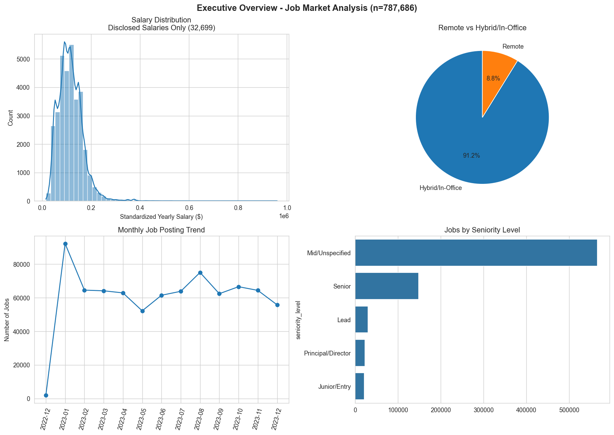

> A high-level summary of the job market, highlighting total job postings, salary trends, hiring patterns, and key business insights.

---

## 💰 Top Paying Jobs

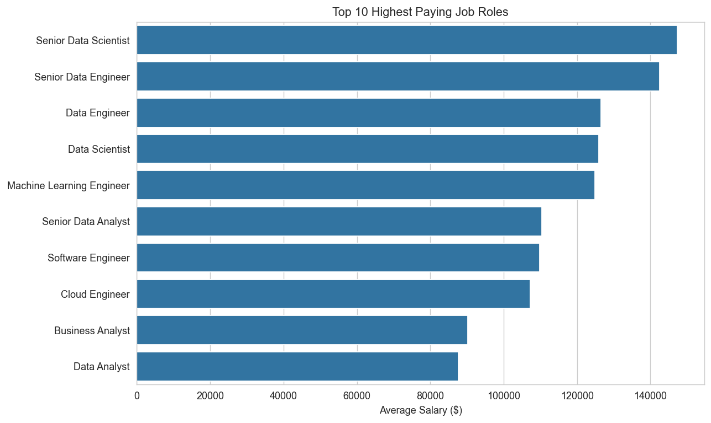

> Displays the highest-paying job roles, helping identify the most lucrative career opportunities in the data industry.

---

## 🏢 Top Hiring Companies

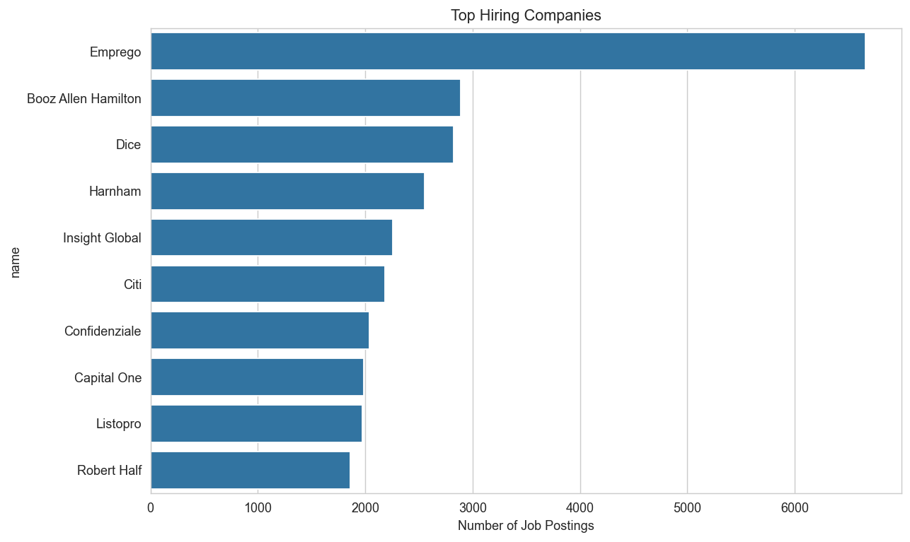

> Highlights organizations with the highest number of job postings, revealing the leading employers in the market.

---

## 💵 Salary Analysis

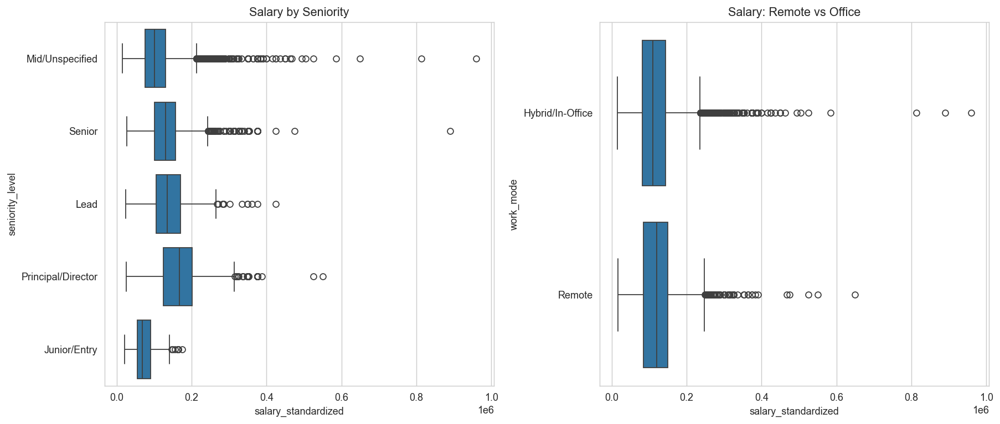

> Visualizes salary distribution across different job roles, making it easier to compare compensation levels.

---

## 📈 Hiring Demand

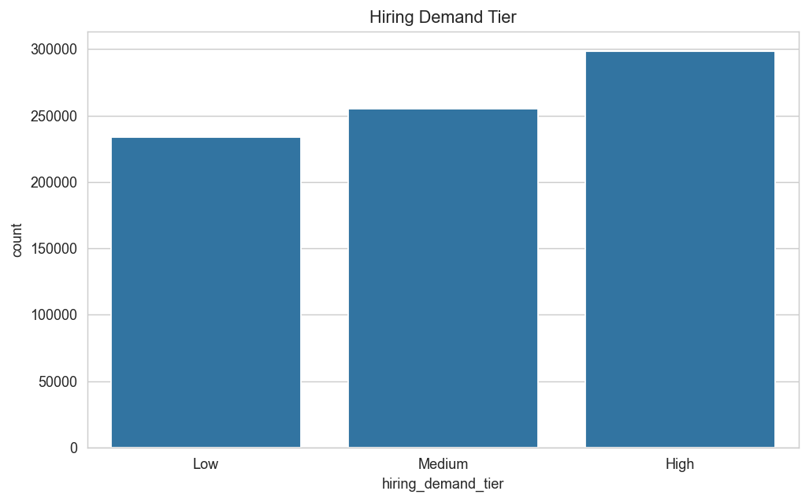

> Shows hiring demand across various data-related roles and identifies the fastest-growing job categories.

---

## 🛠 Skill Catalog

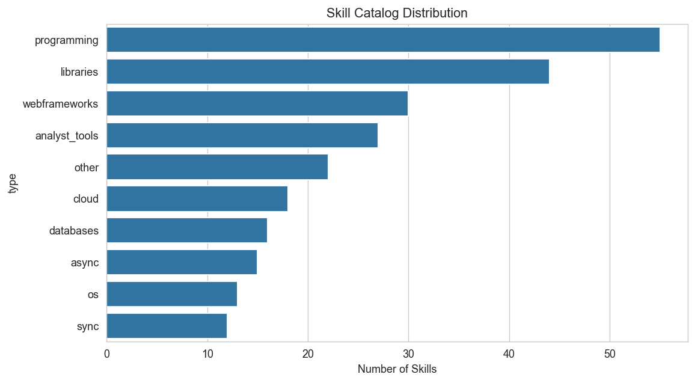

> Provides an overview of the technical skills requested by employers across the job market.

---

## 📊 Skills by Category

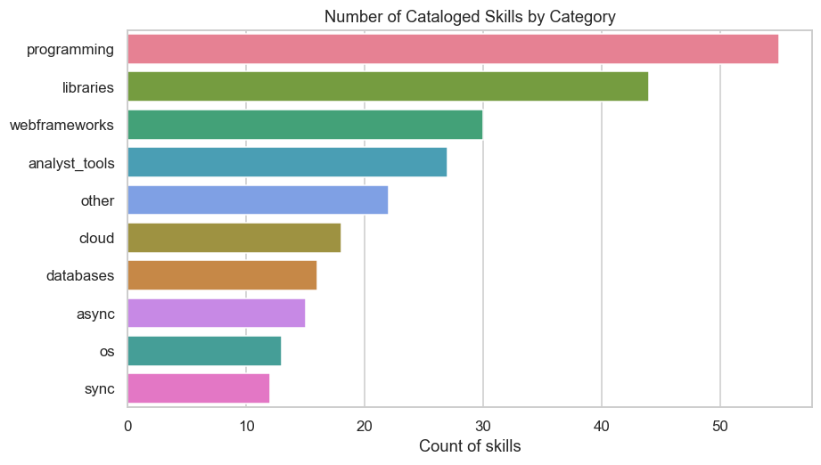

> Breaks down skills into categories such as Programming, Databases, Cloud, BI Tools, and Machine Learning.

---

## 🌐 Company Website Completeness

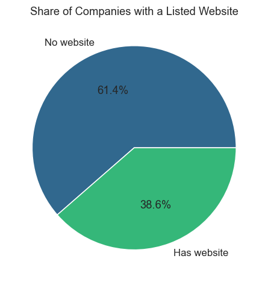

> Evaluates the availability and completeness of company website information within the dataset.

---

## 💰 Top Paying Roles

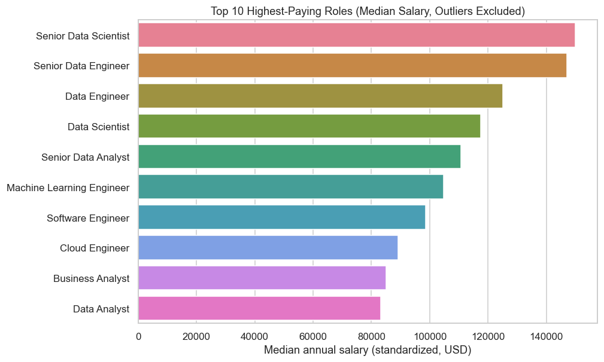

> Compares average salaries across different job titles to identify the most rewarding career paths.

---

## 📦 Salary by Seniority

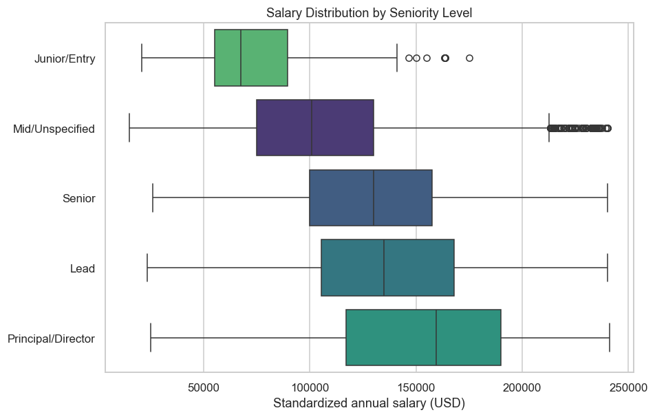

> Illustrates salary variation across seniority levels using box plots, highlighting median salaries and outliers.

---

## 🏠 Remote Hiring Trend

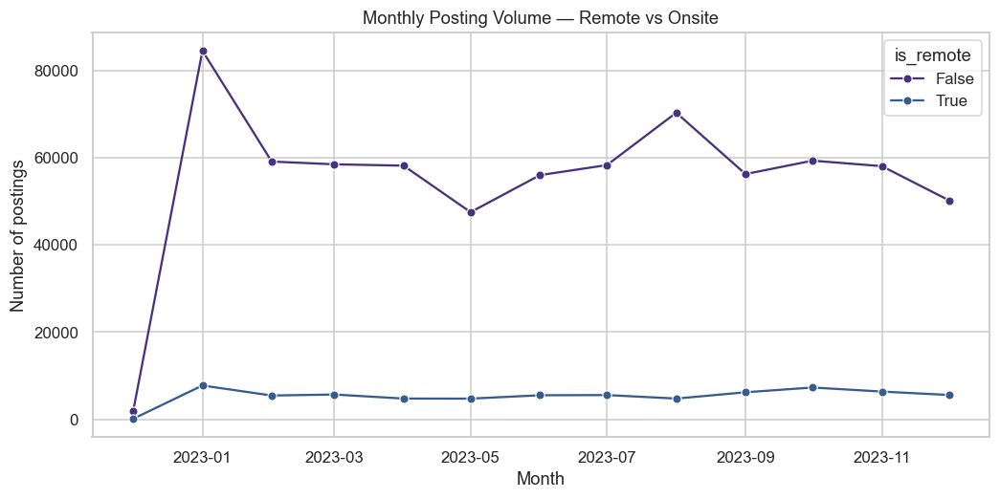

> Examines how remote job opportunities have changed over time and their impact on the job market.

---

## 📈 Skill Count vs Salary

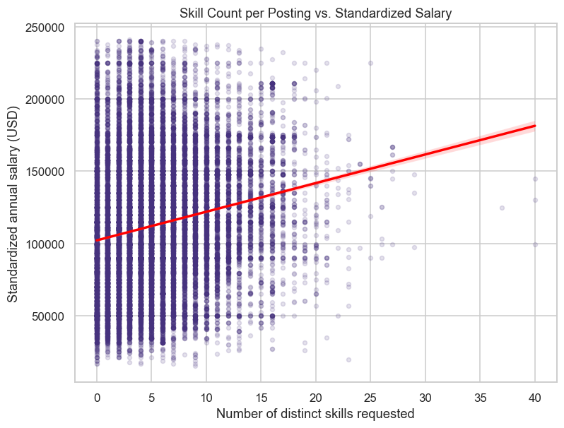

> Explores the relationship between the number of required skills and expected salary.

---

## ⭐ Most Demanded Skills

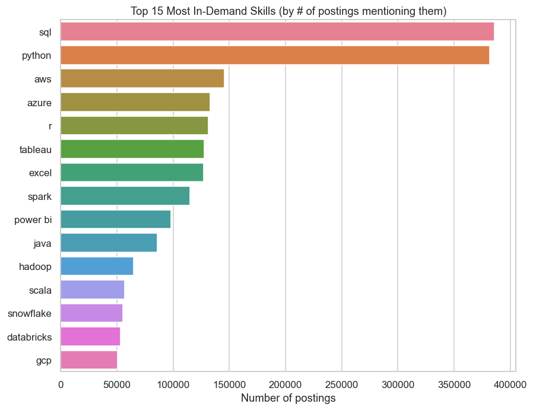

> Displays the most frequently requested technical skills across all analyzed job postings.

---

## 🚀 High Value Skills

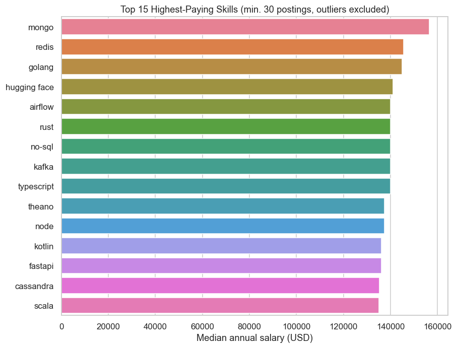

> Identifies skills that combine high employer demand with above-average salaries, helping prioritize learning investments.

---

# 📝 SQL Analysis

The project includes SQL queries for:

- Top Paying Jobs
- Top Paying Skills
- Most Demanded Skills
- Optimal Skills
- Salary Analysis

```text
sql/
│
├── 1_top_paying_jobs.sql
├── 2_top_paying_job_skills.sql
├── 3_top_demanded_skills.sql
├── 4_top_paying_skills.sql
└── 5_optimal_skills.sql
```

---

# 📊 Key Insights

### 💰 Salary

- Senior Data Scientists receive the highest average salaries.
- Remote positions remain highly competitive.

### 📈 Skills

- SQL is the most requested skill.
- Python dominates analytical roles.
- Power BI and Tableau remain the leading BI tools.

### ☁ Cloud

- AWS
- Azure
- BigQuery

are among the highest-paying cloud technologies.

### 🏢 Companies

Major recruiters include:

- Meta
- AT&T
- Mantys
- SmartAsset
- Snowflake

---

# 📁 Repository Structure

```text
Job_Market_Trend_Analysis
│
├── README.md
├── data/
├── sql/
├── notebooks/
├── images/
├── dashboard.pbix
├── Job_Market_Analysis_Professional_Report.pdf
└── Job_Market_Analysis_Dashboard_Guide.pdf
```

---


---

# 🚀 Future Improvements

- Machine Learning Salary Prediction
- Streamlit Dashboard
- Real-time Job Scraping
- AI-powered Career Recommendation System

---


